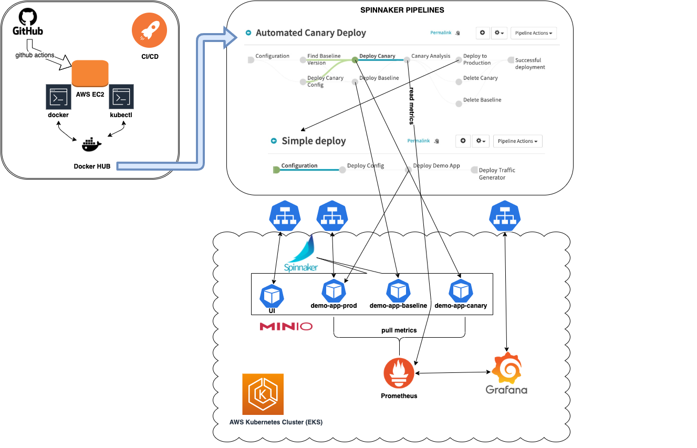

# Canary deployment with Spinnaker

This repository contains all the scripts, files and instructions necessary to create the infrastructure and perform a manual or automated canary deployment in 30 to 60 minutes.

## Overview

Canary is a deployment process in which a change is partially rolled out, then evaluated against the current deployment (baseline) to ensure that the new deployment is operating at least as well as the old. This evaluation is done using key metrics that are chosen when the canary is configured.

#### Tools & Technologies:
* [AWS](https://aws.amazon.com/) - AWS Cloud computing
* [Kubernetes](https://kubernetes.io/) - Container orchestration platform
* [Docker](https://www.docker.com/) - Containerization platform
* [Spinnaker](https://spinnaker.io/) - Continuous delivery software platform
* [MinIO](https://min.io/) - High performance object storage server
* [Prometheus](https://prometheus.io/) - Time-series metrics monitoring tool
* [Grafana](https://aws.amazon.com/) - Observability dashboards for prometheus metrics

#### Repo Structure

```
.
|-- LICENSE                                         
|-- README.md                                       
|-- app                                             # directory containing the demo-app source code and sample kubernetes deploy manifest
|   |-- Dockerfile                                  # the app dockerfile used for building new images
|   |-- app.py                                      # app source code
|   `-- sample.yaml                                 # deployment k8s manifest
|-- config                                          # directory containing config files
|   |-- grafana                                     # grafana related source
|   |   |-- dashboard.json                          # grafana dashboard for demo-app
|   |   `-- datasource.yaml                         # grafana datasource to prometheus service
|   `-- spinnaker                                   # directory containing spinnaker app, pipelines and canary configs
|       |-- app-demo.json                           # demo-app config
|       |-- config-canary.json                      # canary config
|       |-- pipeline-automated-canary-deploy.json   # automated canary deployment pipeline 
|       |-- pipeline-manual-canary-deploy.json      # manual canary deployment pipeline
|       |-- pipeline-simple-deploy.json             # simple deployment pipeline
|       |-- pipeline-trigger-deploy.json            # trigger deployment pipeline on docker hub registry update
|       `-- service-account.yml                     # service account k8s manifest
`-- scripts                                         # directory containing scripts to prepare and deploy infrastructure and app
    |-- init.sh                                     # bash script to initialize required variables used during deployment
    |-- prepare.sh                                  # bash script to install required command lines. must run as root
    |-- deploy.sh                                   # script to deploy the infrastructure: k8s cluster, prometheus, grafana, spinnaker, minio
    `-- create_spinnaker_app.sh                     # script to create a spinnaker demo app, canary config and pipelines             
```
#### Architecture diagram

## Prerequisites

* An AWS account
* A Docker Hub account
* A Github account
* A linux server for deployment purpose (Amazon Linux, or any other flavour with yum package manager). For this demo I use an AWS EC2 t2.small instance with 1vCPU and 2GiB Memory. 

### Prepare deployment server
```
ssh ec2-user@deploy-server

# some credentials needs to be store in files to be used during deployment
echo -n <github-personal-token> > ${HOME}/.github.tkn
echo -n <docker-hub-password> > ${HOME}/.docker.psw
echo "ACCESS_KEY=minio-access-key" > ${HOME}/.minio.creds
echo "SECRET_KEY=m1nioAcc3s5Key" >> ${HOME}/.minio.creds

# configure awscli - get the credentials from your aws Identity and Access Management (IAM)
aws configure
AWS Access Key ID [None]: xxxxxxxxxx
AWS Secret Access Key [None]: xxxxxxxxxxxxxxxxxxxxx
Default region name [None]: eu-central-1
Default output format [None]: json

# install git cli
sudo yum -y install git

git config --global user.name your-github-user
git config --global user.email your-fake-github-email@users.noreply.github.com

git clone https://github.com/DnZmfr/spinnaker-canary-demo.git
cd spinnaker-canary-demo/scripts
# Install required command lines
sudo ./prepare.sh
```

Follow these [instruction](https://github.com/DnZmfr/spinnaker-canary-demo/settings/actions/add-new-runner) to add a GitHub action self-hosted runner used for CI/CD purposes.

## Deploy

### EKS cluster, prometheus, grafana, minio and spinnaker
```
cd spinnaker-canary-demo/scripts
./deploy.sh
```

### Spinnaker demo-app, canary config and pipelines
```
./create_spinnaker_app.sh
```

### Spinnaker pipelines
#### _Simple deploy_ pipeline

1. Get the Spinnaker UI public URL.
2. Open the Spinnaker UI in a browser, go to _**Applications**_ -> _**canary-demo-app**_ -> _**PIPELINES**_ and click on _**Start Manual Execution**_ button of _**Simple deploy**_ pipeline.
3. Select 100 for _**Success Rate**_ parameter and click _**Run**_.

NOTE:
* get the Spinnaker UI public URL with the following command:
```
kubectl -n spinnaker get svc spin-deck-public -o jsonpath='{.status.loadBalancer.ingress[0].hostname}'
```
* 100 success rate means that we will have 100% http requests with status code 200.
* **Simple deploy** pipeline will also deploy a lightweight container which will generate traffic on demo-app service.
* get the public URL of demo-app with the following command: 
```
kubectl get svc canary-demo-service -o jsonpath='{.status.loadBalancer.ingress[0].hostname}'
```

#### _Manual Canary Deploy_ pipeline

1. Open the Spinnaker UI in a browser and start the pipeline with a success rate lower than 100.
2. Get the grafana public URL and import [config/grafana/dashboard.json](config/grafana/dashboard.json) to create a dashboard for the new app.
3. Analyze the ammount of 500 http_code requests between baseline and canary versions, go back to the running pipeline and on the _**Manual Judgment**_ stage click _**Stop**_ if you want to cancel the deployment or _**Continue**_ if you are satisfied with the metrics.

NOTE:
* baseline is a copy of the running production, which is collected by the _**Find Baseline Version**_ stage and then deployed by _**Deploy Baseline**_ under the same service as production.
* get the public URL of grafana with the following command:
```
kubectl -n grafana get svc grafana -o jsonpath='{.status.loadBalancer.ingress[0].hostname}'
```
#### _Automated Canary Deploy_ pipeline

1. Open the Spinnaker UI in a browser and start the pipeline with a success rate lower than 100.
2. The _**Manual Judgment**_ stage here is replaced with _**Canary Analysis**_ which automatically performs 5 analysis of 2 minutes each, comparing the number of 500 http_code requests between the baseline and canary version and based on the result, the new version will be deleted or deployed on production.

## Teardown
```
eksctl delete cluster spinnaker-eks
```